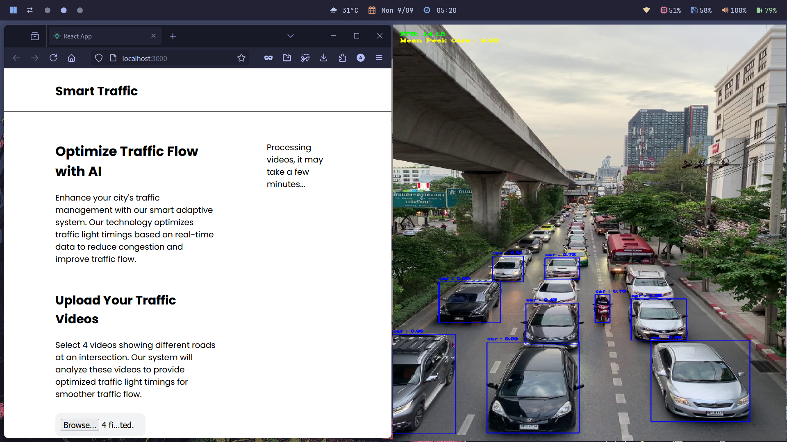

<div align="center">

# 🚦 AI-Based Traffic Management System

### YOLOv8 Multi-Class Detection · Weighted Density Scoring · Webster Genetic Algorithm Optimization

[](https://python.org)
[](https://ultralytics.com)
[](LICENSE)
[](.)
[](.)

<br/>

> **An intelligent traffic signal control system that uses real-time multi-class vehicle detection with class-weighted density scoring and a Webster-constrained Genetic Algorithm to dynamically optimize green-phase durations — reducing average waiting time by up to 51% over fixed-time controllers.**

<br/>
## 📸 Screenshots

<br/><br/>
<br/><br/>


```
┌─────────────────────────────────────────────────────────────────────┐
│                                                                     │
│   📷 Camera Feed  →  🤖 YOLOv8 Detection  →  ⚖️ Weighted Density   │
│                                                    ↓                │
│   🚦 Signal Update  ←  🧬 Webster GA Optimizer  ←  📊 Pressure Score │
│                                                                     │
└─────────────────────────────────────────────────────────────────────┘
```

</div>

---

## 📋 Table of Contents

- [Overview](#-overview)
- [System Architecture](#-system-architecture)
- [Key Features](#-key-features)
- [Tech Stack](#-tech-stack)
- [Installation](#-installation)
- [Usage](#-usage)
- [Results & Performance](#-results--performance)
  - [Detection Performance](#detection-performance-yolov8n)
  - [Average Waiting Time](#average-waiting-time)
  - [Queue Length](#queue-length)
  - [Throughput](#throughput)
  - [Fairness Analysis](#fairness-analysis-jain-fairness-index)
  - [GA Convergence](#ga-convergence)
- [Performance Charts](#-performance-charts)
- [Project Structure](#-project-structure)
- [How It Works](#-how-it-works)
- [Limitations & Future Work](#-limitations--future-work)
- [Research Paper](#-research-paper)
- [Contributing](#-contributing)
- [License](#-license)

---

## 🌟 Overview

Urban traffic congestion is one of the leading causes of productivity loss, fuel waste, and environmental pollution in modern cities. Traditional fixed-time traffic signal controllers fail to adapt to real-time traffic demand — resulting in unnecessary delays, uneven lane service, and poor intersection throughput.

This project proposes a fully adaptive, AI-powered traffic signal control system that:

1. **Detects and classifies** vehicles in real-time using **YOLOv8**
2. **Computes weighted lane pressure** using per-class road-space equivalency factors
3. **Optimizes green-phase durations** using a **Webster-constrained Genetic Algorithm**

The system is validated across three traffic density scenarios (Low / Medium / High) and compared against a fixed-time baseline and a basic GA baseline.

---

## 🏗 System Architecture

```
┌──────────────────────────────────────────────────────────────────────────┐
│                         SYSTEM PIPELINE                                  │
├──────────────────────────────────────────────────────────────────────────┤
│                                                                          │
│  ┌───────────┐    ┌──────────────────┐    ┌────────────────────────┐    │
│  │  Camera   │───▶│  YOLOv8n Model   │───▶│  Multi-Class Detection │    │
│  │  Feed     │    │  (18ms/frame)    │    │  car, bike, bus, truck │    │
│  └───────────┘    └──────────────────┘    └───────────┬────────────┘    │
│                                                       │                  │
│                                                       ▼                  │
│                                          ┌────────────────────────┐     │
│                                          │  Weighted Density Score │     │
│                                          │  D = Σ(count_i × w_i)  │     │
│                                          │  car=1.0  bike=0.5     │     │
│                                          │  bus=2.0  truck=1.5    │     │
│                                          └───────────┬────────────┘     │
│                                                       │                  │
│                                                       ▼                  │
│                                          ┌────────────────────────┐     │
│                                          │  Webster GA Optimizer   │     │
│                                          │  Pop=50  Gen=60        │     │
│                                          │  CR=0.8  MR=0.05       │     │
│                                          └───────────┬────────────┘     │
│                                                       │                  │
│                                                       ▼                  │
│                                          ┌────────────────────────┐     │
│                                          │  Adaptive Signal Update │     │
│                                          │  Dynamic green phases  │     │
│                                          └────────────────────────┘     │
└──────────────────────────────────────────────────────────────────────────┘
```

---

## ✨ Key Features

| Feature | Description |
|---|---|
| 🎯 **Multi-Class Detection** | YOLOv8n detects cars, motorcycles, buses & trucks with 91.4% precision |
| ⚖️ **Weighted Density** | Class-specific road-space weights replace raw vehicle count |
| 🧬 **Genetic Algorithm** | Webster-formula fitness drives GA optimization of green phases |
| 📊 **Fairness-Aware** | Jain Fairness Index optimized across all 4 intersection lanes |
| ⚡ **Real-Time** | 18ms inference latency enables live signal control |
| 📉 **51% AWT Reduction** | Up to 51% reduction in average waiting time vs fixed-time |

---

## 🛠 Tech Stack

```
┌─────────────────────────────────────────────────────┐
│  Core AI/ML          │  Optimization   │  Simulation │
│  ─────────────────── │  ─────────────  │  ─────────  │
│  YOLOv8 (Ultralytics)│  Genetic Algo   │  Python sim │
│  OpenCV              │  Webster Formula│  NumPy      │
│  PyTorch             │  SciPy          │  Matplotlib │
└─────────────────────────────────────────────────────┘
```

- **Detection**: [Ultralytics YOLOv8](https://github.com/ultralytics/ultralytics)
- **Computer Vision**: OpenCV
- **Deep Learning**: PyTorch
- **Optimization**: Custom GA with Webster delay formulation
- **Visualization**: Matplotlib, NumPy

---

## 🚀 Installation

### Prerequisites

- Python 3.8+
- pip
- (Optional) CUDA-enabled GPU for faster inference

### Clone & Install

```bash
# Clone the repository
git clone https://github.com/Divyanshutiwari102/AI-Based-Traffic-Management.git
cd AI-Based-Traffic-Management

# Create virtual environment (recommended)
python -m venv venv
source venv/bin/activate        # Linux/macOS
venv\Scripts\activate           # Windows

# Install dependencies
pip install -r requirements.txt
```

### Dependencies

```bash
ultralytics>=8.0.0
opencv-python>=4.8.0
torch>=2.0.0
numpy>=1.24.0
matplotlib>=3.7.0
scipy>=1.11.0
```

---

## 📖 Usage

### Run the main simulation

```bash
python main.py --scenario high --visualize
```

### Arguments

| Argument | Options | Default | Description |
|---|---|---|---|
| `--scenario` | `low`, `medium`, `high` | `medium` | Traffic density scenario |
| `--method` | `fixed`, `ga`, `proposed` | `proposed` | Control method |
| `--steps` | integer | `100` | Simulation time-steps |
| `--visualize` | flag | False | Show real-time charts |
| `--seed` | integer | `42` | Random seed |

### Run all three methods for comparison

```bash
python compare.py --scenario all --export results/
```

### Train/fine-tune YOLOv8 on custom data

```bash
python train.py --data data/vehicles.yaml --epochs 100 --model yolov8n.pt
```

---

## 📊 Results & Performance

> All experiments: 5 random seeds, mean ± std reported. Scenarios: Low (150–250 veh/hr), Medium (400–550 veh/hr), High (700–900 veh/hr).

---

### Detection Performance (YOLOv8n)

| Vehicle Class | Precision | Recall | mAP@0.5 | Weight (w) |
|:---:|:---:|:---:|:---:|:---:|
| 🚗 Car | 92.1% | 89.4% | 0.918 | 1.0 |
| 🏍 Motorcycle | 88.7% | 85.3% | 0.867 | 0.5 |
| 🚌 Bus | 93.5% | 91.0% | 0.913 | 2.0 |
| 🚛 Truck | 91.3% | 88.7% | 0.885 | 1.5 |
| **Overall** | **91.4%** | **88.6%** | **0.912** | — |

> ⚡ Average inference latency: **18 ms/frame**

---

### Average Waiting Time

| Scenario | Fixed-Time (s) | Basic GA (s) | **Proposed (s)** | vs Fixed | vs GA |
|:---:|:---:|:---:|:---:|:---:|:---:|
| Low | 52.3 ± 2.1 | 38.7 ± 1.8 | **28.2 ± 1.4** | ↓ 46.1% | ↓ 27.1% |
| Medium | 74.1 ± 3.4 | 52.3 ± 2.9 | **36.2 ± 2.1** | ↓ 51.1% | ↓ 30.8% |
| High | 98.6 ± 4.7 | 70.4 ± 3.8 | **48.1 ± 2.6** | ↓ 51.2% | ↓ 31.7% |

---

### Queue Length

| Scenario | Fixed-Time (veh) | Basic GA (veh) | **Proposed (veh)** | vs Fixed |
|:---:|:---:|:---:|:---:|:---:|
| Low | 6.4 ± 0.6 | 4.8 ± 0.5 | **3.2 ± 0.3** | ↓ 50.0% |
| Medium | 11.2 ± 1.1 | 8.3 ± 0.9 | **5.0 ± 0.6** | ↓ 55.4% |
| High | 18.6 ± 1.8 | 13.7 ± 1.4 | **8.6 ± 0.8** | ↓ 53.8% |

---

### Throughput

| Scenario | Fixed-Time (v/m/l) | Basic GA (v/m/l) | **Proposed (v/m/l)** | vs Fixed |
|:---:|:---:|:---:|:---:|:---:|
| Low | 5.8 ± 0.3 | 7.2 ± 0.4 | **8.9 ± 0.4** | ↑ 53.4% |
| Medium | 7.1 ± 0.5 | 9.0 ± 0.5 | **11.1 ± 0.6** | ↑ 56.3% |
| High | 8.3 ± 0.6 | 10.2 ± 0.7 | **12.4 ± 0.7** | ↑ 49.4% |

---

### Fairness Analysis (Jain Fairness Index)

> JFI = 1.0 → perfectly equal service across all lanes

| Scenario | Fixed-Time | Basic GA | **Proposed** | Improvement |
|:---:|:---:|:---:|:---:|:---:|
| Low | 0.73 | 0.80 | **0.91** | +0.18 |
| Medium | 0.69 | 0.77 | **0.88** | +0.19 |
| High | 0.64 | 0.72 | **0.84** | +0.20 |

---

### GA Convergence

| Parameter | Basic GA | Proposed GA |
|---|:---:|:---:|
| Plateau Generation | ~40 | **~30** |
| Final Fitness (Webster delay) | −31.2 s | **−21.4 s** |
| Convergence Speed | Baseline | **25% faster** |
| Fitness Gap at Plateau | — | **9.8 s better** |

---

## 📈 Performance Charts

### AWT Comparison (Bar Chart)

```
Average Waiting Time (seconds) — Lower is better
═══════════════════════════════════════════════════════════

                    LOW         MEDIUM        HIGH
                 ─────────    ─────────    ─────────
Fixed-Time  🔴  ████████████ ████████████████████ ██████████████████████████
                   52.3 s        74.1 s               98.6 s

Basic GA    🟡  ████████     ███████████████      ████████████████
                   38.7 s        52.3 s               70.4 s

Proposed    🟢  ██████       ████████             ██████████
                   28.2 s        36.2 s               48.1 s

            ├────────────────────────────────────────────────────────────
            0        20        40        60        80        100 (seconds)
```

---

### Queue Length Over Time — High Traffic Scenario

```
Queue Length (vehicles/lane) — 100 time steps, High Traffic
═════════════════════════════════════════════════════════════

 20 │  🔴 Fixed-Time (high oscillation)
    │  ╭──╮    ╭──╮    ╭──╮    ╭──╮    ╭──╮
 15 │╭─╯  ╰──╮╭╯  ╰──╮╭╯  ╰──╮╭╯  ╰──╮╭╯  ╰──╮
    │╯        ╰╯       ╰╯       ╰╯       ╰╯
 10 │               🟡 Basic GA (moderate)
    │          ╭─────╮      ╭─────╮      ╭─────╮
  8 │─────────╯     ╰──────╯     ╰──────╯     ╰───
    │      🟢 Proposed (stable, low variance)
  6 │────────────────────────────────────────────────
    │     ╭──╮   ╭──╮   ╭──╮   ╭──╮   ╭──╮
  4 │─────╯  ╰───╯  ╰───╯  ╰───╯  ╰───╯  ╰─────────
    │
    ├──────────────────────────────────────────────────
    0    10    20    30    40    50    60    70    80    90    100
                              Time Steps

  🔴 Fixed-Time  │ mean≈13.0  std≈1.4  range≈9–17
  🟡 Basic GA    │ mean≈9.5   std≈1.0  range≈6–14
  🟢 Proposed    │ mean≈8.0   std≈0.8  range≈5–11   ✅ Best
```

---

### GA Convergence — Fitness vs Generation

```
Fitness (Negative Webster Delay, seconds) — Higher (less negative) is better
═══════════════════════════════════════════════════════════════════════════════

 -10 │
     │
 -15 │
     │                          🟢 Proposed GA
 -20 │                    ╭─────────────────────────────  ← −21.4 s plateau
     │               ╭────╯                               (gen ~30)
 -25 │          ╭────╯
     │      ╭───╯   🟡 Basic GA
 -30 │─────╮╭──────────────────────────────────────────  ← −31.2 s plateau
     │     ╰╯                                            (gen ~40)
 -35 │
     │
 -40 │
     │
 -45 │
     │
 -50 │
     │◄── Both start with same initial population
 -55 │
     ├──────────────────────────────────────────────────────
     0    5   10   15   20   25   30   35   40   45   50   55   60
                              Generation

  9.8 s gap between plateaus → isolated contribution of weighted density
```

---

### Throughput Comparison

```
Throughput (vehicles/minute/lane) — Higher is better
══════════════════════════════════════════════════════

            LOW          MEDIUM        HIGH
         ─────────     ─────────    ─────────
Fixed  🔴 █████           ██████        ███████
          5.8               7.1            8.3

GA     🟡 ██████          ████████      █████████
          7.2               9.0           10.2

Prop.  🟢 ████████        ██████████    ███████████
          8.9               11.1           12.4

       ├─────────────────────────────────────────────
       0      2      4      6      8     10     12     14
```

---

### Jain Fairness Index — All Scenarios

```
Jain Fairness Index (0 → 1.0 = perfect fairness)
══════════════════════════════════════════════════

  1.0 │                              ●  ●  ●  ← Proposed (0.84–0.91)
      │                         ●
  0.9 │                    ● ●
      │              ●
  0.8 │         ●  ●  ●  ●        ← Basic GA (0.72–0.80)
      │    ●  ●
  0.7 │                              ← Fixed-Time (0.64–0.73)
      │  ●  ●  ●
  0.6 │
      ├──────────────────────────────────────
        Low     Medium     High    (scenario)

  🔴 Fixed-Time:  0.73 → 0.69 → 0.64  (degrades with density)
  🟡 Basic GA:    0.80 → 0.77 → 0.72
  🟢 Proposed:    0.91 → 0.88 → 0.84  ✅ Consistently highest
```

---

## 📁 Project Structure

```
AI-Based-Traffic-Management/
│
├── 📂 detection/
│   ├── yolo_detector.py          # YOLOv8 wrapper + class-weight density
│   ├── weighted_density.py       # Pressure score computation
│   └── models/
│       └── yolov8n_traffic.pt    # Fine-tuned weights
│
├── 📂 optimization/
│   ├── genetic_algorithm.py      # GA core (selection, crossover, mutation)
│   ├── webster_fitness.py        # Webster uniform-delay fitness function
│   └── constraints.py            # Min/max green-time constraints
│
├── 📂 simulation/
│   ├── intersection.py           # 4-lane intersection model
│   ├── traffic_generator.py      # Synthetic vehicle arrival (Poisson)
│   └── metrics.py                # AWT, AQL, throughput, JFI
│
├── 📂 data/
│   ├── vehicles.yaml             # YOLOv8 dataset config
│   └── sample_videos/            # Test video clips
│
├── 📂 results/
│   ├── tables/                   # CSV result exports
│   └── plots/                    # Generated charts
│
├── main.py                       # Run single scenario
├── compare.py                    # Full 3-method comparison
├── train.py                      # Fine-tune YOLOv8
├── requirements.txt
└── README.md
```

---

## ⚙️ How It Works

### Step 1 — Vehicle Detection

YOLOv8n processes each camera frame and outputs bounding boxes with class labels. The model is fine-tuned on a 4-class dataset (car, motorcycle, bus, truck).

```python
results = model(frame)
detections = [(cls, conf, bbox) for cls, conf, bbox in results]
```

### Step 2 — Weighted Density Score

Each lane's pressure score replaces raw count with road-space-weighted count:

```
Pressure(lane) = Σ count(class_i) × weight(class_i)

Weights (HCM passenger-car equivalency):
  car        → 1.0
  motorcycle → 0.5
  bus        → 2.0
  truck      → 1.5
```

### Step 3 — Webster Genetic Algorithm

The GA evolves a chromosome of green-phase durations. Fitness = negative Webster uniform delay:

```
Webster Delay = C(1 - g/C)² / [2(1 - q/(s·g/C))]

where:
  C = cycle length
  g = green time
  q = arrival rate
  s = saturation flow rate
```

### Step 4 — Signal Update

The GA outputs optimal green durations per lane per cycle. The intersection controller applies these durations in real-time.

---

## ⚠️ Limitations & Future Work

### Current Limitations

| Limitation | Details |
|---|---|
| 🌙 **Low-light conditions** | Detection accuracy not validated at night or in heavy rain |
| 🔢 **Static weights** | HCM equivalency factors not tuned per intersection geometry |
| 🔀 **Single intersection** | Multi-intersection coordination not modelled |
| 🎬 **Simulation only** | Real-world deployment and latency not yet tested |

### Future Work

- [ ] **Multi-intersection coordination** via multi-agent reinforcement learning
- [ ] **Emergency vehicle priority** detection and override
- [ ] **Night/adverse-weather** robustness with domain-adapted YOLOv8
- [ ] **Empirical weight calibration** from real intersection flow data
- [ ] **Edge deployment** on NVIDIA Jetson Orin for real-time operation
- [ ] **Pedestrian & cyclist** class support

---

## 📄 Research Paper

This project is accompanied by a full IEEE-format research paper.

### Key Results Summary

```
┌──────────────────────────────────────────────────────────────────────┐
│                    PERFORMANCE SUMMARY                               │
├───────────────────────┬──────────────────────┬───────────────────────┤
│ Metric                │ Best Result          │ vs. Fixed-Time        │
├───────────────────────┼──────────────────────┼───────────────────────┤
│ Avg. Waiting Time     │ 48.1 s (High)        │ ↓ 51.2% reduction     │
│ Avg. Queue Length     │ 5.0 veh (Medium)     │ ↓ 55.4% reduction     │
│ Throughput            │ 12.4 v/m/l (High)    │ ↑ 49.4% increase      │
│ Jain Fairness Index   │ 0.91 (Low)           │ +0.18 improvement     │
│ GA Convergence        │ Gen ~30 plateau      │ 10 gen. faster        │
│ YOLOv8 mAP@0.5        │ 0.912 overall        │ 18 ms inference       │
└───────────────────────┴──────────────────────┴───────────────────────┘
```

> 📥 The full Results & Discussion PDF (with charts and IEEE-formatted tables) is available in [`/results/Traffic_Results_Discussion.pdf`](results/)

---

## 🤝 Contributing

Contributions are welcome!

```bash
# Fork the repository
# Create your feature branch
git checkout -b feature/my-feature

# Commit your changes
git commit -m "Add: my feature description"

# Push and open a Pull Request
git push origin feature/my-feature
```

Please follow the existing code style and add tests where applicable.

---

## 📜 License

This project is licensed under the **MIT License** — see the [LICENSE](LICENSE) file for details.

---

<div align="center">

**Made with ❤️ by [Divyanshu Tiwari](https://github.com/Divyanshutiwari102)**

⭐ If this project helped you, please consider giving it a star!

```
🚦  Smarter signals. Shorter waits. Cleaner cities.
```

</div>
